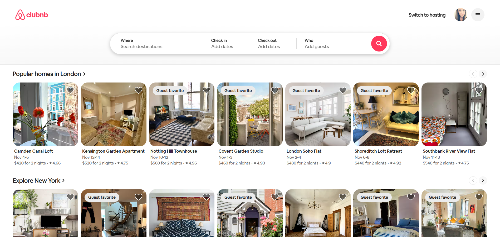

# 🏠 Clubnb — Your Next Home Away From Home


**Live Demo:** [clubnb.onrender.com](https://clubnb.onrender.com/)

A modern, full-stack home rental platform built with React, Redux, and real-time socket communication. Think Airbnb meets cutting-edge web technology.



---

## ✨ What Makes Clubnb Special

### 🔍 Smart Search & Discovery
- **Dynamic filtering** by destination, dates, guest count, and price range
- **Instant results** with smooth transitions and loading states
- **Persistent wishlist** that saves your favorites across sessions

### 🏡 Immersive Listing Experience
- **Rich image galleries** with lightbox navigation
- **Interactive Google Maps** showing exact locations
- **Detailed amenities** with icon-based UI
- **Guest reviews** with ratings and verified badges
- **Host profiles** with superhost status and response times

### 💳 Seamless Booking Flow
- **Multi-step checkout** with date selection and guest management
- **Real-time price calculations** (nightly rate + cleaning + service fees)
- **Instant confirmations** with animated success modals
- **Order history** for both guests and hosts

### 💬 Real-Time Communication
- **Chat messaging** between guests and hosts
- **Socket.io integration** for instant message delivery
- **Typing indicators** and read receipts
- **Conversation history** persisted across sessions

### 🎨 Modern UI/UX
- **Responsive design** that works flawlessly on any device
- **Smooth animations** and micro-interactions
- **Accessible components** following WCAG guidelines
- **Dark mode support** (coming soon!)

---

## 🛠️ Tech Stack

### Core
- **React 18** — Modern hooks and concurrent features
- **Redux** — Predictable state management
- **Vite** — Lightning-fast dev server and builds
- **Socket.io-client** — Real-time bidirectional communication

### Styling & UI
- **SCSS** — Modular and maintainable styles
- **CSS Modules** — Scoped component styling
- **Responsive utilities** — Mobile-first approach

### Integrations
- **Google Maps API** — Interactive location displays
- **Cloudinary** — Optimized image delivery
- **PWA Support** — Service worker for offline capabilities

---

## 🚀 Quick Start

### Prerequisites
- Node.js 18+ and npm

### Installation

```bash
# Clone the repository
git clone https://github.com/InbalMary/frontend.git
cd frontend

# Install dependencies
npm install

# Start development server
npm run dev
```

Visit `http://localhost:5173` to see the app in action!

---

## 📂 Project Architecture

```
clubnb-frontend/
├── public/                  # Static assets (images, icons)
├── src/
│   ├── pages/              # Route components
│   │   ├── StayIndex.jsx   # Home page with search
│   │   ├── StayDetails.jsx # Listing details page
│   │   ├── StayChat.jsx    # Real-time messaging
│   │   └── MsgIndex.jsx    # Message inbox
│   ├── cmps/               # Reusable components
│   │   ├── StayList.jsx    # Listing cards grid
│   │   ├── StayFilter.jsx  # Search filters
│   │   ├── HostInfo.jsx    # Host profile card
│   │   └── ReserveModule.jsx # Booking widget
│   ├── services/           # API & utilities
│   │   ├── stay/           # Stay CRUD operations
│   │   ├── user/           # Auth & user management
│   │   ├── order/          # Booking services
│   │   └── socket.service.js # Real-time events
│   ├── store/              # Redux modules
│   │   ├── actions/        # Action creators
│   │   └── reducers/       # State reducers
│   └── customHooks/        # Reusable hooks
└── index.html              # App entry point
```

---

## 🎯 Key Features Breakdown

### For Guests
✅ Browse thousands of unique stays  
✅ Filter by location, dates, guests, and price  
✅ Save favorites to wishlist  
✅ Book instantly with secure checkout  
✅ Message hosts directly  
✅ View booking history and upcoming trips  

### For Hosts
✅ List properties with rich details  
✅ Manage reservations (approve/decline)  
✅ Communicate with guests in real-time  
✅ Track earnings and occupancy  
✅ Edit listings on the fly  

---

## 🔥 Advanced Features

### Real-Time Order Notifications
```javascript
// Frontend: Host receives instant notification when guest books
socketService.on('update-host-orders', (order) => {
    if (order.hostId === currentUser._id) {
        loadOrders() // Refresh reservations list
        showNotification('New booking received!')
    }
})

// Frontend: Guest gets live updates when host approves/declines
socketService.on('update-guest-orders', (order) => {
    loadOrders() // Update trip status instantly
    showNotification(`Booking ${order.status}!`)
})

// Backend: Broadcast order updates to all connected clients
socket.on('order-status-changed', (orderData) => {
    gIo.emit('update-guest-orders', orderData)
})
```

### Smart State Management
- **Optimistic updates** for instant UI feedback
- **Normalized state** for efficient data access
- **Action creators** for clean, testable logic
- **Redux DevTools** integration for debugging

### Performance Optimizations
- **Code splitting** with dynamic imports
- **Lazy loading** for images and routes
- **Memoized selectors** to prevent unnecessary re-renders
- **Debounced search** to reduce API calls

---

## 🧪 Available Scripts

```bash
npm run dev          # Start dev server (Windows-friendly)
npm run dev:local    # Local development mode
npm run build        # Production build
npm run preview      # Preview production build
npm run lint         # Run ESLint
```

---

## 🌐 Environment Variables

Create a `.env` file:

```env
VITE_LOCAL=false                    # Toggle local/demo mode
VITE_API_URL=https://your-api.com  # Backend API endpoint
VITE_GOOGLE_MAPS_KEY=your_key      # Google Maps API key
```

---

## 🤝 Team & Collaboration

Built by a **three-developer team** following industry best practices:

- **Git workflow:** Feature branches → Pull Requests → Code Review → Merge
- **Clear responsibilities:** Frontend, Backend, and DevOps roles
- **Pair programming:** For complex features like real-time chat

---

## 🔗 Related Repositories

- **Backend (Node.js + MongoDB):** [clubnb-backend](https://github.com/InbalMary/clubnb-backend)
- **Frontend (This repo):** You are here!

---

## 🐛 Troubleshooting

**Dependencies not installing?**
```bash
# Clear cache and reinstall
rm -rf node_modules package-lock.json
npm install
```

**Vite server not starting?**
```bash
# Try alternate dev script
npm run dev:remote
```

**Socket.io connection errors?**
- Ensure backend is running on `http://localhost:3030`
- Check CORS settings in backend
- Verify `VITE_LOCAL` environment variable

---

## 🚀 Deployment

The app is deployed on **Render** with automatic deployments from the `main` branch.

### Build Configuration
```json
{
  "build": "npm run build",
  "publish": "dist"
}
```

---

## 🎓 What We Learned

This project challenged us to master:
- **Real-time architecture** with Socket.io
- **Complex state management** with Redux
- **Responsive design** for mobile-first experiences
- **Git collaboration** in a team environment
- **Production deployment** on cloud platforms

---

## 📧 Contact

Questions? Ideas? Feedback?

- **GitHub:** [@InbalMary](https://github.com/InbalMary)
- **GitHub:** [@Yulia-C](https://github.com/Yulia-C)
- **GitHub:** [@Michal-Om](https://github.com/Michal-Om)

- **Live Demo:** [clubnb.onrender.com](https://clubnb.onrender.com/)

---

## 🌟 Star this repo if you found it helpful!

Made with ❤️ and ☕ by the Clubnb team